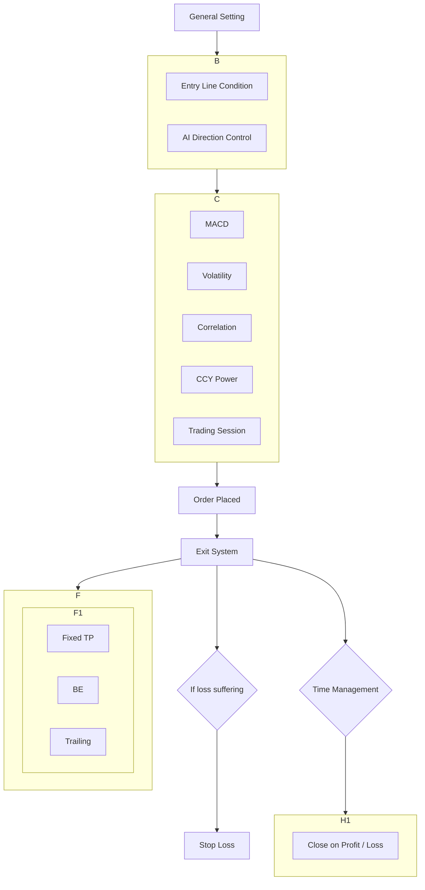

好的，這就為您提取前五頁的內容。

### **Page_01.png**
Forex Forest®
Algorithmic Trading

# FLASH
## 操作指南
### EXPERT ADVISOR
自動交易程序

---
### **Page_02.png**
## CONTENT 內容
| 主題 | 頁碼 |
| --- | --- |
| Flash Introduction基本介紹 | 2 |
| Flow Chart流程圖 | 3 |
| BASIC SETTING基本設置 | 4 |
| ENTRY SYSTEM – MAIN主要入市設置 | 5 |
| ENTRY SYSTEM – ADDITION輔助入市設置 | 9 |
| MACD Filter 平滑異同移動平均線指標過濾 | 10 |
| Volatility Filter 貨幣波動性過濾 | 12 |
| Correlation Filter 貨幣相關性過濾 | 14 |
| CCY Power Filter 貨幣力學過濾 | 16 |
| ENTRY ORDER MANAGEMENT入市訂單管理 | 19 |
| EXIT SYSTEM出市設置 | 21 |
| TRADING SESSION交易時間設置 | 26 |
| DISPLAY – Misc雜項 | 27 |

---
### **Page_03.png**
## Flash 基本介紹
Flash是一個自家出品,以捕捉突破關鍵價格水平為策略的交易程式,會不斷在市場上對支持及阻力位掃瞄,利用突破位置交易入市。

基礎入市原理以關鍵價格水平作依歸,當價位突破上方關鍵價格水平以上就會進行買盤操作,相反如價位低於下方關鍵價格水平則會進行賣盤操作。另加入不同的輔助入市設置,如:AI方向控制、MACD技術指標、貨幣波動性、貨幣相關性、貨幣力學等指標,增加入市準確率。
所有交易都包含保護性止損,還包括移動追蹤、收支平衡和一個靈活的經濟新聞過濾器。

### Flash的特點:
*   除特別註明外,Flash主要輸入的數值都以Points作基礎。
*   用了最新CODING 技術,令PC或VPS不會負載過重。
*   使用API技術,可以促進Flash策略方案有效率進行。
*   可以與其他EA和腳本(Scripts)合作。
*   可以啟用貨幣強弱指標過濾器。
*   具有價差(Spread)和滑點(Slippage),當價差處於過大時,可以限制它們的交易。

---
### **Page_04.png**
## Flow Chart 流程圖

---
### **Page_05.png**
## Basic Setting 基本設置

| 設定 | 值 |
| :--- | :--- |
| **`=== BASIC SETTING ===`** | |
| Trade Mode | Open and Close Trades |
| Close Only Mode when above DD% (0=not used) | 15.0 |
| Reset Trade Mode when below DD% (-1=not used) | 0.0 |
| HFT Mode (10x speed up) | Off |

### Trade Mode 交易模式
1.  **Open New Trades Only:** 只可進行新開交易
2.  **Close Existing Trades Only:** 只可將現有持倉交易平倉
3.  **Open and Close Trades:** 可進行新單交易或將現有持倉交易平倉

### Close Only Mode when above DD% 當損益比率超過某個百分比時 僅平倉模式
*   當帳戶Drawdown大過指定數值,只可將現有持倉交易平倉
*   0 代表不用此功能

### Reset Trade Mode when below DD% 當損益比率低過某個百分比時 重置交易模式
*   當帳戶Drawdown小過指定數值,會重置為原來的交易模式
*   -1 代表不用此功能

### HFT Mode 高頻交易模式
1.  **On:** EA每秒不斷運算,即使所選擇交易的貨幣對沒有報價跳動,仍然會不斷運算
2.  **Off:** 只會在所選擇交易的貨幣對有報價跳動時才作運算
高頻交易模式因為耗費電腦資源,通常只用於極高達入市的策略上,例如炒新聞、又或者利用低時間框架的CCY Power突破入市,以免出現出入市延誤的情況。
好的，這就為您提取 page_06.png 到 page_10.png 的內容。

### **Page 06**

#### **Entry System - Main主要入市設置**

**Entry Line Condition**

| 參數 | 值 |
| :--- | :--- |
| === ENTRY SYSTEM - MAIN === | === Entry Line Condition === |
| Check Timeframe | M30 |
| Check Start | 1 |
| Check Level | 3 |
| Check Distance in Points | 200 |
| Entry Line Displacement in Points (0-not u... | 10 |

---

#### **Check Timeframe 檢查的時間框架:**

1.  M30
2.  H1
3.  H4

---

#### **Check Start 用以作為檢查範圍的陰陽燭**

*   以此陰陽燭的最高及最低價格位置作為一個不會入市的範圍 (Pending Line Bar Start)
*   必須輸入正整數 (0-無限)
*   現價陰陽燭為0, 向左一支為1, 如此類推
*   請注意: 如以現價陰陽作為檢查範圍 (即Check Start=0), 會以Open Price作為計算, 亦等於沒有Pending Line Bar Start。而剛放EA到Chart時, 會以 Bar 0 的 High Low 作為檢查範圍

**例子:**
Check Start = 1

---

### **Page 07**

#### **Check Level 需要檢查的陰陽燭數量**

*   以此位置的陰陽燭作中心點, 與左右兩邊陰陽燭比較, 計算入市位置 (計算方法請參考下圖)
*   必須是 >=2 的正整數 (2-無限), 小於2會自動調整並設為2
*   如果小於CheckStart, 則CheckStart數值會被自動調整並設為0
*   最多只會計算到現價前的500支陰陽燭

**例子:**
Check Level = 3, Check Start = 1

由現價Bar向左開始計算, 第3支陰陽燭作為中心點。現時此組別的中心點陰陽燭最高最低價並沒有超過左右的陰陽燭, 因此未能找出入市位置。此時會將整個組別向左移一格。

此組別的中心點陰陽燭雖然是整個組別的最低價, 但因為價位仍在Pending line bar start範圍內, 所以入市位置未能成立, 會繼續將整個組別向左移。

---

### **Page 08**

直至來到現在的組別, 中心點陰陽燭是整個組別的最高價, 亦在Pending line bar start範圍外, 此入市價位便初步成立, 下一步再視乎此價位是否在Check Distance範圍內。
註: Sell Stop概念相同

---

#### **Check Distance in Point 進行交易之距離**

*   以現價的上下範圍計算
*   於此距離範圍內才會進行入市
*   必須輸入正整數 (0-無限)

**例子:**
Check Distance = 200

經過之前Check Level的運算, 如找到的入市訊號位置於Check Distance內, 入市訊號便成立, 會出現Buy Stop Signal Line。如現價升到Buy Stop Signal Line便會進行入市 (Buy Order)。

---

**注意:**

1.  Check Distance數值太少, 會容易在Pending line bar start範圍內, 入市信號便難以成立。
2.  Check Start如設定為0, 只會以open price作為Pending line bar start範圍, 意思等同將Pending line bar start範圍的功能停用。

---

### **Page 09**

#### **Entry Line Displacement in Point 提早入市設定**

*   設定提早入市位置
*   最大可輸入數值 50, 如數值大於 50, 會自動調整為 50

**例子:**
Entry Line Displacement in Point = 10
會比Buy Stop入市信號提早10 points入市。
註: Sell Stop概念相同

---

### **Page 10**

#### **Entry System - Addition輔助入市設置**

**AI Direction Control**

| 參數 | 值 |
| :--- | :--- |
| === ENTRY SYSTEM - FILTER === | === AI Direction Control === |
| AI Source | AI 1 |
| Use AI Direction Control | On |

---

*   以貨幣力學、技術指標、背馳以及國家新聞等資訊, 預測貨幣未來40小時的走勢
*   每4小時更新一次
*   可以進行Back Test ( 可Back Test時段請參考EA About內提示)

---

#### **AI Source 運算模式:**

**1. AI 1**
Identify Uptrend / Downtrend預測升市 / 跌市

**2. AI 2**
Identify Uptrend / Downtrend / No trend 預測升市 / 跌市 / 橫行市

*   **Uptrend:** 只會進行Buy Order入市
*   **Downtrend:** 只會進行Sell Order入市
*   **No trend:** 不進行入市

---

#### **Use AI Direction Control 以AI作為入市方向控制:**

1.  **On:** 啟用
2.  **Off:** 關閉
### page_11.png

**MACD Filter**

| 參數 | 數值 |
| :--- | :--- |
| === ENTRY SYSTEM - FILTER === | === MACD Filter === |
| Use MACD | Off |
| MACD Timeframe | H4 |
| Fast MACD Period | 12 |
| Slow MACD Period | 26 |
| Signal MACD Period | 9 |
| MACD Applied Price | Close price |
| MACD Shift | 1 |
| MACD Diff Buy Above in pips | 0.0 |
| MACD Diff Sell Above in pips | 0.0 |

*   MACD 中文名是「指數平滑異同移動平均線」(Moving Average Convergence & Divergence)
*   透過計算「收盤時股價或指數變化的指數移動平均值 (EMA)」之間的離差程度(DIFF)而來,用來確定波段漲幅並找到買賣點
*   一般MACD以兩條線及柱作顯示,但在Forex Forest自家研發的EA下,只會顯示一條線及柱

**Use MACD以MACD 作為入市輔助**
1.  On: 啟用
2.  Off: 關閉

**MACD Timeframe 時間框架計算**
1.  Current
2.  M1
3.  M5
4.  M15
5.  M30
6.  H1
7.  H4
8.  D1
9.  W1
10. MN1

**Fast MACD Period 快捷平均線 / Slow MACD Period慢線平均線 / Signal MACD Period訊號線**
1.  陰陽燭計算數量
2.  必須為正整數 (1~無限)

### page_12.png

**MACD Applied Price 應用價位**
1.  Close price收盤價
2.  Open price開盤價
3.  High price最高價
4.  Low price最低價
5.  Median price最高價與最低價的中間值
6.  Typical price最高價+最低價+收盤價的1/3
7.  Weighted price最高價+最低價+收盤價+收盤價的1/4

*(圖表顯示買賣訊號)*

**MACD Shift 計算偏移**
*   必須是正整數 (0~無限)
*   例: Shift=0,代表取用以現價bar的數據作為計算基礎
*   例: Shift=1,代表取用以現價bar向左第1支bar的數據作為計算基礎

**MACD Diff Buy Above in pips / MACD Diff Sell Above in pips 差價差距**
*   線與柱之間的差距需要大於設定數值才進行入市
*   可任意輸入數值

*(圖表顯示線與柱當刻的差距)*

### page_13.png

**Volatility Filter**

| 參數 | 數值 |
| :--- | :--- |
| === ENTRY SYSTEM - FILTER === | === Volatility Filter === |
| Use Volatility Ranking | On |
| Volatility Timeframe | M30 |
| Volatility Period | 5 |
| Trade From x Rank | 1 |
| Trade Until x Rank | 5 |

*   用以顯示28個貨幣對波動值及排名
*   用以篩選合適波幅的貨幣對進行入市
*   此項功能並不能進行BT

**Use Volatility Ranking 以波動性排行作為入市輔助**
1.  On: 啟用
2.  Off: 關閉

**Volatility Timeframe時間框架計算**
1.  Current
2.  M1
3.  M5
4.  M15
5.  M30
6.  H1
7.  H4
8.  D1
9.  W1
10. MN1

**Volatility Period 波動性計算時期**
*   陰陽燭計算數量
*   必須輸入正整數 (1~無限)

**Trade From x Rank / Trade Until x Rank 以此排名範圍內作入市**
*   可輸入數值由1至28

### page_14.png

**請留意**

*   利用indicator Volatility Table檢視28個貨幣對的數值與排名
*   Timeframe與Period的部份建議要與EA內Setting相同,才可獲得相對的數值
*   Market Watch需要顯示28個貨幣對

**Volatility Table**

| Variable | Value |
| :--- | :--- |
| === SETTING === | |
| Volatility Timeframe | 30 Minutes |
| Volatility Period | 5 |
| Volatility Shift | 0 |
| CCY(s) | AUD,CAD,CHF,EUR,GBP,JPY,NZD,USD |
| Symbol Suffix (empty-auto detect) | |
| === DISPLAY === | |
| Corner on | Left upper chart corner |

*(圖表顯示 "建議要與 EA 內 Setting 相同")*
*(圖表顯示 "只有第1位至第5位貨幣對才會觸發交易")*

### page_15.png

**Correlation Filter**

| 參數 | 數值 |
| :--- | :--- |
| === ENTRY SYSTEM - FILTER === | === Correlation Filter === |
| Use Correlation Filter | Off |
| Correlation Timeframe | H1 |
| Correlation Period | 50 |
| Maximum Correlation | 70.0 |
| Minimum Correlation | 0.0 |

*   分析28個貨幣對的走勢相連性,即兩個貨幣對之間的同步性
*   正數值越高同步值越高;負數值越高逆向值越高
*   此項功能並不能進行BT

**Use Correlation Filter 以貨幣相關性過濾作為入市輔-助**
1.  On: 啟用
2.  Off: 關閉

**Correlation Timeframe 時間框架計算**
1.  Current
2.  M1
3.  M5
4.  M15
5.  M30
6.  H1
7.  H4
8.  D1
9.  W1
10. MN1

**Correlation Period 相聯性計算時期**
*   陰陽燭計算數量
*   必須輸入正整數 (1~無限)

**Maximum Correlation / Minimum Correlation 相關性最高值及最低值**
*   可輸入數值由0至100
*   輸入之數值已包括正值及負值 (eg. 70已代表 +70 及 -70)
*   相關性於此數值以外的貨幣對不作交易
### page_16.png

**請留意**

*   利用Forex Correlation Smart Indicator 檢視28個貨幣對的相聯性
*   Timeframe與Period的部份建議要與EA內Setting相同,才可獲得相對的數值
*   Market Watch需要顯示28個貨幣對

**Forex Correlation Smart Indicator**

| Variable | Value |
| :--- | :--- |
| **=== SETTING ===** |
| Correlation Timeframe | 1 Hour |
| Correlation Period | 50 **建議要與 EA 內 Setting 相同** |
| Correlation Shift | 0 |
| Symbol(s) | AUDCAD,AUDCHF,AUDJPY,AUDNZD,AUDUSD,... |
| Correlation Limit | 80.0 |

---
### page_17.png

**CCY ENTRY SYSTEM - FILTER**

| | |
| :--- | :--- |
| **=== CCY Power Filter ===** | **=== CCY Power Filter ===** |
| Use CCY Power Entry | On |
| CCY Power Timeframe | D1 |
| CCY Power Period | 2 |
| CCY Power Difference | 4.0 |
| Strong CCY Power lower than or equals to | 7.0 |
| Strong CCY Power higher than or equals to | 5.0 |
| Weak CCY Power lower than or equals to | 2.0 |
| Weak CCY Power higher than or equals to | 1.0 |
| Entry Line Front Sensing Area in Points(Y) | 100 |
| Entry Line Rear Sensing Area in Points(X) | 100 |

*   運用貨幣力學分析各貨幣之間的強弱走勢, 如Chart非28對貨幣對, Power Filter 會如常運行, 但要注意非常用8隻貨幣, Power只會顯示0, 無法正確分析走勢, 在此情況下請關掉 Power Filter此項功能並不能進行BT

**Use CCY Power Entry 以貨幣力學指標作為入市輔助**
1.  On: 啟用
2.  Off: 關閉

**CCY Power Timeframe 時間框架計算**

| | | | | |
| :--- | :--- | :--- | :--- | :--- |
| 1. Current | 2. M1 | 3. M5 | 4. M15 | 5. M30 |
| 6. H1 | 7. H4 | 8. D1 | 9. W1 | 10. MN1 |

**CCY Power Period 貨幣強弱計算時期**
*   陰陽燭計算數量
*   必須輸入正整數 (1~無限)

**CCY Power Difference 貨幣強弱差距**
*   兩貨幣強弱相差大於此數值才觸發入市
*   可輸入數值由0至9

**Strong CCY Power lower than or equal to / Strong CCY Power higher than or equal to 強勢貨幣的數值範圍**
*   強勢貨幣的數值於此範圍內才觸發入市
*   可輸入數值由0至9
*   lower數值必須大於higher數值

---
### page_18.png

**Weak CCY Power lower than or equal to / Weak CCY Power higher than or equal to 弱勢貨幣的數值範圍**
*   弱勢貨幣的數值於此範圍內才觸發入市
*   可輸入數值由0至9
*   lower數值必須大於higher數值

**請留意**
*   利用CCY Power Indicator檢視貨幣對的強弱指數
*   Timeframe與Period的部份建議要與EA內Setting相同,才可獲得相對的數值
*   Market Watch需要顯示28個貨幣對

**CCY Power Indicator**

| Variable | Value |
| :--- | :--- |
| **=== BASIC SETTING ===** | **=== Basic Setting ===** |
| Display Mode | Chart CCY Power |
| Timeframe (close price) | 1 Day **建議要與 EA 內 Setting 相同** |
| Period | 2 |
| **=== Display ===** |
| Show Chart Symbol only | Off |
| Show Central Line | On |
| Strong level | 6.0 |
| Weak level | 3.0 |
| Show Power Ranking Panel | On |

---
### page_19.png

**Entry Line Front Sensing Area in Points (Y) 入市信訊提前感應區**
*   提前入市範圍
*   可任意輸入數值

**Entry Line Rear Sensing Area in Points (X) 入市信訊延後感應區**
*   延後入市範圍
*   可任意輸入數值

**例子:**
(圖表顯示一個買入止損的例子)
*   X Point
*   Sensing Area
*   Buy Stop
*   Y Point
*   價位於 Sensing Area 內, CCY Power 數值符合設定, 便可進行入市

**註: Sell Stop概念相同**

---
### page_20.png

**Entry Order Management 入市訂單管理**

**Order Lot Size Setting**

| | |
| :--- | :--- |
| **=== ENTRY ORDER MANAGEMENT ===** | **=== Order Lot Size Settings ===** |
| Fixed Lot Size | 0.01 |
| Use Auto Lot (On-disable fixed lot) | On |
| Auto Lot Size in % of Balance | 1.0 |

**Fixed Lot Size 固定入市手數**
*   每次入市的手數
*   必須是正整數 (0~無限)

**Use Auto Lot (On-disable fixed lot) 自動計算入市手數**
*   1.On: 啟用 – 開啟後固定入市手數將停用
*   2.Off: 關閉

**Auto Lot Size in % of Balance 自動入市比例**
*   每次入市都會自動計算手數
*   以交易戶口Balance金額計算(如有Credit亦有計算在內)
*   計算方法: 戶口Balance x 所設定百分比 x 槓桿比率(Broker提供) ÷ 合約值Contract size
*   注意: 合約值現時默認為100,000, 如非外匯交易在計算合約值時有可能有不同
*   假設: 戶口Balance = $10,000, 百分比 = 1%, 槓桿比率 = 500
*   手數: 10,000 x 1% x 500 ÷ 100,000 = 0.5 lots

**Order General Setting**

| | |
| :--- | :--- |
| **=== ENTRY ORDER MANAGEMENT ===** | **=== Order General Settings ===** |
| Magic Number (Buy) | 77 |
| Order Comment (Buy) | Flash is the best |
| Magic Number (Sell) | 77 |
| Order Comment (Sell) | Flash is the best |
| Max Spread in Points | 30 |
| Max Slippage in Points | 30 |
| Exit Max Spread Filter | Off |

**Magic Number (Buy / Sell)**
*   每次開單EA都會將Magic Number記錄,平倉時會根據Magic Number來確認訂單
*   必須為正整數 (0~無限)
*   如不輸入數值,會自動轉為0
好的，這就為您提取這些頁面的文字。

### page_21.png

#### Order Comment (Buy / Sell)
*   每次開單EA都會將Comment記錄，平倉時會根據Comment來確認訂單
*   可任意輸入英文字及數值
*   最多只能輸入28個字元

#### Max Spread in Points 容許最大價差
*   價差是指貨幣對的買入價和賣出價之間的差額
*   必須為正整數 (10~無限)，如數值低於10，會自動調整為10
*   設定最大價差數值，當價差大於設定數值，不會進行入市

#### Max Slippage in Points 容許最大滑價
*   必須為正整數 (0~無限)
*   滑價是指交易的預期價格和交易執行價格之間的差異
*   設定最大滑價數值，當滑價大於設定數值，不會進行入市

#### Exit Max Spread Filter 出市最大價差過濾器
*   價差是指貨幣對的買入價和賣出價之間的差額
*   設定最大價差價位,當價差超過設定的最大點差時,不會進行出市
*   必須為正整數 (0~無限)

---

### page_22.png

### Exit System 出市設置

#### Single 1st Order Exit
`=== EXIT SYSTEM ===`
`=== Single 1st Order Exit ===`

| 參數 | 值 |
| --- | --- |
| Take Profit in Points | 0 |
| Stoploss in Points | 1600 |
| Use Virtual SL | On |
| Use Trailing | On |

#### Take Profit in points 固定獲利設定
*   固定獲利數值
*   必須為正整數 (100~無限)，設定少於100，會自動轉回7000

#### Stoploss in points 固定止損設定
*   固定止損數值
*   必須為正整數 (20~無限)，設定少於20，會自動轉回20

#### Use Virtual SL 隱藏止損價位
*   當啟動此功能時,止損價位不會顯示於MT4的訂單記錄上,直至價格到達才進行止損

#### Trailing Exit System 移動止損

| 參數 | 值 |
| --- | --- |
| Use Trailing | On |
| Trailing Start in Points | 100 |
| Trailing Distance in Points | 50 |
| Trailing Distance Reduce Limit in Points | 400 |
| Trailing Distance Reduce Ratio in % | 40 |
| Trailing Distance Reduce Frequency in Points | 2 |

*   移動止損又稱追蹤止損 (Trailing Stop)，將隨最新價格設置相距最新價格固定點數的止損，只隨讓價位向的有利方向變動而觸發，是在進入獲利階段時設置的功能
*   如同時使用 Breakeven, 只會於 Breakeven Start < Trailing Start 才會議 Trailing 在 Trailing Start 時啟動

#### Use Trailing 使用移動止損功能
1.  On: 啟用
2.  Off: 關閉

---

### page_23.png

#### Trailing Start in Points 固定獲利設定
*   入市後如浮動達到此數值便觸發
*   必須為正整數 (20~無限)，如數值少於20，會自動調整為20

#### Trailing Distance in Points 平倉位置與現價距離
*   價格回調多少便進行平倉
*   必須為正整數 (0~無限)

#### 例子:
*   Check Distance = 5, Entry Displacement in Points = 50
*   Trailing Start in Points = 100, Trailing Distance in Points = 50

*註: Sell Stop概念相同*

---

### page_24.png

#### Trailing Distance Reduce Limit in Points 移動止損距離減少
*   入市後如浮動達到此數值便啟動
*   必須是正整數 (0~無限)

#### Trailing Distance Reduce Ratio in % 移動止損距離減少比率
*   每次距離收窄百分比
*   可輸入數值由1至100,如數值為0, Reduce效果就是0

#### Trailing Distance Reduce Frequency in Points 移動止損距離減少頻率
*   收窄距離頻率
*   必須為正整數 (1~無限)

#### 例子:

| 參數 | 值 |
| --- | --- |
| Trailing Start in Points | 200 |
| Trailing Distance in Points | 100 |
| Trailing Distance Reduce Limit in Points | 300 |
| Trailing Distance Reduce Ratio in % | 20 |
| Trailing Distance Reduce Frequency in Points | 50 |

假設買入價格為1.20000,浮盈300 points開始會進行移動止損距離減少(Trailing distance reduce),浮盈每增加50 points會再進一步減少移動止損距離,每次距離減少20%

| 現價價格 | 浮盈 (points) | 移動止損距離 (distance points) | 移動止損平倉價位 (Trailing SL) | 備註 |
| :--- | :--- | :--- | :--- | :--- |
| 1.20200 | 200 | 100 | 1.20100 | Trailing Start |
| 1.20300 | 300 | 100 | 1.20200 | Trailing Reduce Start |
| 1.20350 | 350 | 80 | 1.20270 | 100x(1-20%) |
| 1.20400 | 400 | 60 | 1.20340 | 100x(1-40%) |
| 1.20450 | 450 | 40 | 1.20410 | 100x(1-60%) |
| 1.20500 | 500 | 20 | 1.20480 | 100x(1-80%) |
| 1.20550 | 550 | 0 | 回調便直接平倉 | 100x(1-100%) |

---

### page_25.png

#### Breakeven Exit System

| 參數 | 值 |
| --- | --- |
| Use Breakeven | On |
| Breakeven Start in Points | 50 |
| Breakeven Distance in Points | 10 |

*   將止損位設定至與開單價位附近,以消除成本虧損的風險
*   若同時使用 Trailing, 如設定為 Breakeven Start >= Trailing Start, 會使 Trailing 失效

#### Use Breakeven 使用盈虧平衡止損功能
1.  On: 啟用
2.  Off: 關閉

#### Breakeven Start in Points 盈虧平衡止損的起步距離
*   入市後如浮動達到此數值便啟動
*   必須為正整數 (0~無限)

#### Breakeven Distance in Points 平倉位置與現價距離
*   價格回調到距離開單價格幾points便進行平倉
*   必須為正整數 (0~無限)
*   注意: Breakeven Start - Breakeven Distance 最好大於 Broker 指定的最小距離 (通常為 31 points), 否則未必能即時觸發

#### 例子:
*   Check Distance = 5, Entry Displacement in Points = 50
*   Breakeven Start in Points = 50
*   Breakeven Distance in Points = 10

*   觸發 Breakeven Start 後，
*   持倉回調至與開單價格相距 10 points 便會平倉
*   \*平倉位置不含根據價格持續上升而改變
好的，這就為您提取 page_26.png 到 page_30.png 的可見文字。

### **Page 26**

#### Trailing VS Breakeven

*   **Trailing**: Trailing 的平倉位置會根據現價不斷地調整。
*   **Breakeven**: Breakeven 的平倉位置是固定不變的。

#### Single 1st Order Lifetime Exit

| 參數 | 值 |
| :--- | :--- |
| Use Lifetime Exit | On |
| Exit after x minutes | 120 |
| Close on Profit | Off |
| Close on Loss | On |

*   根據設定時間按時進行平倉。

**Use Lifetime Exit 使用按時離場功能**
1.  **On**: 啟用
2.  **Off**: 關閉

**Exit after x minutes 離場時間設定**
*   入市後指定平倉時間 (以分鐘計算)
*   必須是正整數 (0=無限)

**Close on Profit / Loss 獲利時離場 / 虧損時離場**
1.  **On**: 啟用
2.  **Off**: 關閉

**例子:**

1.  **設定:**
    | 參數 | 值 |
    | :--- | :--- |
    | Use Lifetime Exit | On |
    | Exit after x minutes | 120 |
    | Close on Profit | On |
    | Close on Loss | On |
    此設定會令入市後 120 分鐘，不論獲利中或虧損中都會進行平倉。

2.  **設定:**
    | 參數 | 值 |
    | :--- | :--- |
    | Use Lifetime Exit | On |
    | Exit after x minutes | 120 |
    | Close on Profit | On |
    | Close on Loss | Off |
    此設定會令入市後 120 分鐘，只在獲利中才會進行平倉。

---

### **Page 27**

#### Time Cooldown

| 參數 | 值 |
| :--- | :--- |
| === EXIT SYSTEM === | === Time Cooldown === |
| Use Time Cooldown After Close | On |
| Cooldown in Minutes | 60 |

**Cooldown After Close 以移動平均線進行冷卻期**
1.  **On**: 啟用
2.  **Off**: 關閉

**Cooldown in Minutes 冷卻時間**
*   平倉後的冷卻時間，以分鐘計算。

#### Trading Session 交易時段設置

| 參數 | 值 |
| :--- | :--- |
| === TRADING SESSION === | === Trading Session (GMT) === |
| Time Standard | Follow Market Watch |
| Use Trading Session | On |
| Trading Session | 02:00-22:00 |
| Trade Friday | On |
| Close on Friday End | Off |

**Time Standard 時區**
*   **Follow Market Watch**: 根據Broker時區
*   **Follow GMT+0**: 根據GTM+0時區

**Use Trading Session 啟用交易時段**
1.  **On**: 啟用
2.  **Off**: 關閉

**Trading Session 設定交易時段**
*   設定可進行交易的時間。
*   必須是指定格式 HH:MM-HH:MM。

**Trade Friday 允許星期五進行交易**
1.  **On**: 啟用
2.  **Off**: 關閉

**Close on Friday End 星期五完結時自動平倉**
1.  **On**: 啟用
2.  **Off**: 關閉

---

### **Page 28**

#### Display & Misc 其他

| 參數 | 值 |
| :--- | :--- |
| === DISPLAY === | === Misc === |
| Show Panel | Off |
| Send BED Signal (Backtest Use) | On |
| Export Analytics Summary Report (Backtest Use) | On |
| Display Trade Mode | On Chart Comment |
| Display Remark | On |

**Show Panel 面板:**
*   提供啟動面板功能，可以獨立選擇啟動與否。
*   會於交易圖表左上角出現控制面板。
*   會於交易圖表左上角劃出 Buy stop / Sell stop / Breakeven / Trailing 等位置線。
*   會於交易圖表左下角顯示 MACD / Volatility / CCY Power / AI signal 等資訊。

**左下角資訊顏色顯示代表:**
*   **黑色**: Both Direction
*   **綠色**: Buy Only
*   **紅色**: Sell Only
*   **灰色**: No Trade

**Send BED Signal (Backtest Use) 發送BED訊號 (只供回測用):**
*   提供啟動發送 BED 訊號選項。
*   BED Signal 即顯示 Balance, Equity 及 Drawdown 資料。

**Export Analytics Summary Report (Backtest Use) 匯出交易記錄報表 (只供回測用):**
*   提供啟動匯出交易記錄報表選項。

**Display Trade Mode 顯示交易模式:**
*   **No Display**: 交易模式不會顯示。
*   **On Chart Comment**: 交易模式將顯示在圖表的左上角並在備註旁。
*   **On Chart Center**: 交易模式將顯示在圖表的中央位置。

**Display Remark 顯示備註:**
*   將輸入的備註顯示在圖表的左上角。

---

### **Page 29**

筆記

---

### **Page 30**

筆記
page_31.png
筆記

page_32.png
[呢頁冇可見文字]
